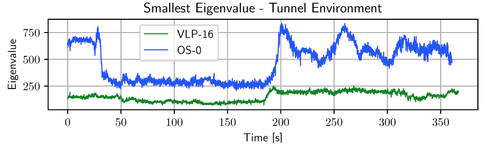
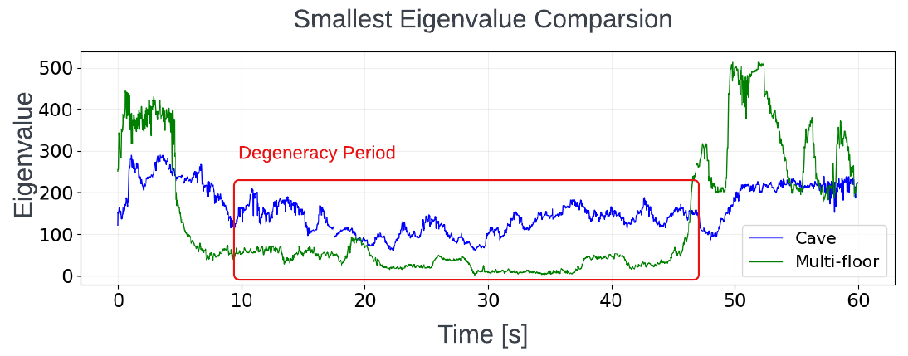
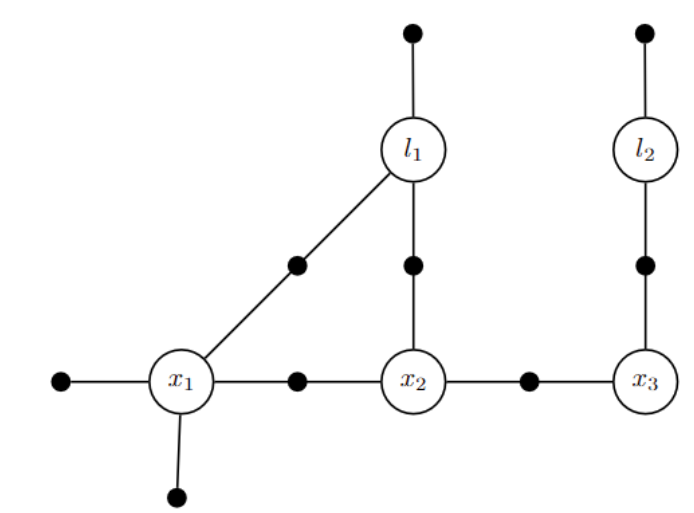
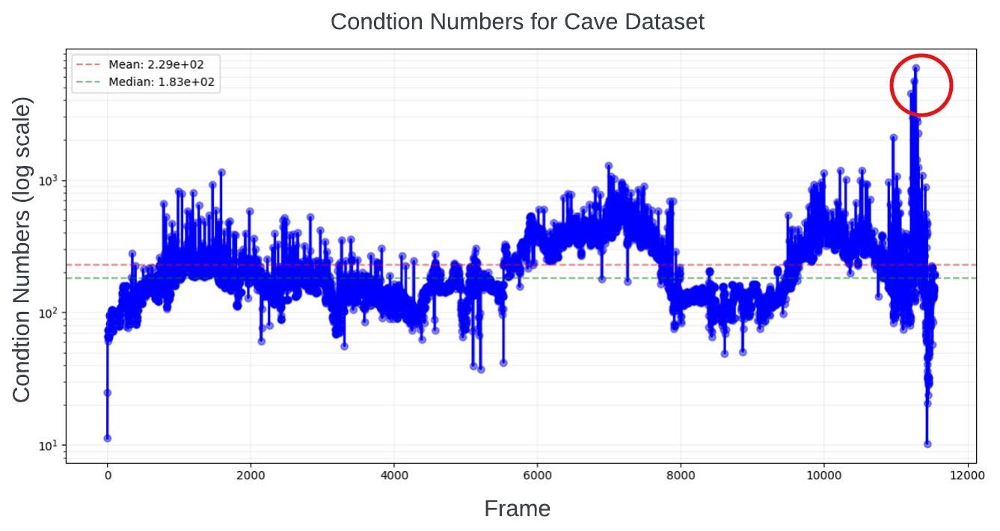
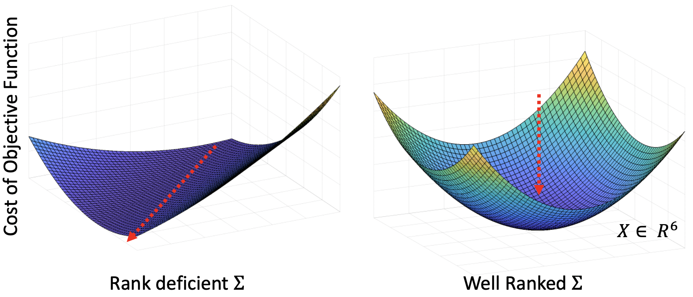

# Why Predictive Alignment Risk?

Dealing degeneracy with LiDAR-Inertial localization in SLAM (Simultaneous localization and mapping) community has been an active research topic for decades. The motivation behind such research is the investigation of ICP (Iterative Closest Point) solving failures, the principal algorithm for LiDAR-Inertial localization. ICP calculates the optimal transformation between two sets of point cloud. As Censi[^1] concluded, ICP failure is unfolded by three main reasons:

1. Bad initial guess for ICP optimization
2. Sensor Noise 
3. <b>Degeneracy</b>

To address the question of <b>Why Predict Alignment Risk?</b>, we examine common approaches to detect and prevent degeneracy in robotics and their limitations. Approches from previous literatures can be best concluded in two methods: 1) detect ICP failures under degeneracy through ICP hessian analysis[^2] [^4] [^5] and use this analysis to constrain ICP pose solving. 2) fuse external sensor sources using ICP covariance to prevent failures. However, there are two limitations associate with using ICP hessian analysis and its covariance: 

1. Degeneracy detection using ICP hessian is difficult to generalize across different sensor modalities and environments.
2. ICP covariance is rank deficient under degeneracy 

This article will unfold these limitations in more details. But first, let's revisit how can we obtain ICP covariance and its hessian to detect degeneracy, using Prakhya et al.[^5] and Tuna et al.[^3] as reference. 

### ICP Covariance Modeling and Hessian Analysis
Let assume z be the measurements and x be the output of an function A that minimizes an objective function J i.e., $$\mathbf{x}=A(\mathbf{z})=\operatorname{argmin}_{\mathbf{X}} J(\mathbf{z}, \mathbf{x})$$. Then the approximate value of the covariance of $$\mathbf{x}$$ in terms of $$A(\mathbf{z})$$ in will be,

$$
\begin{equation}
\operatorname{cov}(\mathbf{x})=\operatorname{cov}\left(\left.A(\mathbf{z})\right|_{\mathbf{z}=\mathbf{z}_o}\right) \approx \frac{\partial A}{\partial \mathbf{z}_o} \operatorname{cov}(\mathbf{z}) \frac{\partial A^T}{\partial \mathbf{z}_o}
\end{equation}
$$

Using the implicit function theorem (appendix in [^1]), 

$$
\begin{equation}
\frac{\partial A}{\partial \mathbf{z}_o}=-\left(\frac{\partial^2 J}{\partial \mathbf{x}^2}\right)^{-1}\left(\frac{\partial^2 J}{\partial \mathbf{z} \partial \mathbf{x}}\right)
\end{equation}
$$

Rewrite Eq. 1 into, 

$$
\begin{equation}
\begin{gathered}
\operatorname{cov}(\mathbf{x})=\left(\frac{\partial^2 J}{\partial \mathbf{x}^2}\right)^{-1}\left(\frac{\partial^2 J}{\partial \mathbf{z} \partial \mathbf{x}}\right) \operatorname{cov}(\mathbf{z})\left(\frac{\partial^2 J}{\partial \mathbf{z} \partial \mathbf{x}}\right)^T\left(\frac{\partial^2 J}{\partial \mathbf{x}^2}\right)^{-1}
\end{gathered}
\end{equation}
$$

The objective function for point-to-point ICP is formulate below, 

$$
\begin{equation}
J=\sum_{i=1}^n\left\|\mathbf{R} \mathbf{P}_{\mathbf{i}}+\mathbf{T}-\mathbf{Q}_{\mathbf{i}}\right\|^{\mathbf{2}}
\end{equation}
$$

where $$\{\mathbf{P}_{\mathbf{i}},\mathbf{Q}_{\mathbf{i}}\}$$ are the point cloud correspondences, and $$[\mathbf{R}, \mathbf{T}]$$ is the homogeneous transformation estimated by ICP. <b>The ICP covariance</b> can be calculated using Eq. 3, where $$\mathbf{x}=\left[\begin{array}{@{}llllll@{}}x & y & z & r & p & y\end{array}\right]$$ and $$\mathbf{z}$$ represents $$n$$ sets of correspondences $$\{\mathbf{P}_{\mathbf{i}},\mathbf{Q}_{\mathbf{i}}\}$$. $$\frac{\partial^2 \mathbf{J}}{\partial \mathbf{x}^2}$$ is the <b>ICP hessian matrix $$\mathbf{H} \in \mathbb{R}^{6\times6}$$ </b>. 

Apply eigen-decomposition to $$\mathbf{H}$$,

$$
\begin{equation}
\boldsymbol{H}=\boldsymbol{V} \Sigma \boldsymbol{V}
\end{equation}
$$

where diagonal element of $$\Sigma \in\left\{\operatorname{diag}(\boldsymbol{v}): \boldsymbol{v} \in \mathbb{R}_{\geq 0}^n\right\}$$ are eigenvalues and $$\boldsymbol{V} \in \mathbb{R}^{6 \times 6}$$ are the eigenvectors in matrix form. The idea of degeneracy detection is to observe the null space of $$\mathbf{H}$$. By examining $$\Sigma$$, one can identify the least-constrained pose elements of $$\mathbf{x}$$ by looking at the lowest eigenvalues.

### Degeneracy detection using ICP hessian is difficult to generalize across different sensor modalities and environments

The effectiveness of ICP hessian analysis for degeneracy detection varies significantly across different LiDAR sensors and environments. Nubert et al. [^6] demonstrated this variability through an experiment comparing the lowest eigenvalues from two LiDAR sensors: Velodyne and Ouster, as shown in Fig. 1. Additional validation using the [SuperLoc dataset](https://superodometry.com/superloc)(Cave03 and Floor01) revealed similar variations across different environments, as shown in Fig. 2. These large differences in lowest eigenvalues indicate that eigenvalue-based parameters cannot be over-applied across different sensor modalities or environments, limiting the Hessian's generalizability. This makes constrained ICP using eigenvalue-based appraoch less durable. 

    
    
<i>Figure 1: Comparsion between different LiDAR sensors (Nubert et al.)</i>

 

    
    
<i>Figure 2: Comparsion between different environments: Degeneracy period indicates the most degraded section of each dataset.  </i>

### ICP covariance is rank deficient under degeneracy

A full-ranked covariance matrix is crucial for performing sensor fusion. As mention earlier, sensor fusion with external source such as visual odometry, GPS, etc. is also a common method to prevent degeneracy. Sensor fusion is usually implemented using Factor Graph ([GTSAM](https://gtsam.org/))[^7] or Extended Kalman Filter (EKF). Solving factor graph or EKF requires health weight, usually the covariance, of each sensor. In SuperLoc, we use Factor Graph. Factor Graph inferences Maximum a posteriori (MAP) with Gaussian noise model into nonlinear least-square problem. 

    
    
<i>Figure 3: Factor graph for the toy SLAM problem</i>

 

$$
\begin{equation}
\begin{aligned}
X^{\text {MAP}} & =\underset{X}{\operatorname{argmax}} \phi(X) \\
& =\underset{X}{\operatorname{argmax}} \prod_i \phi_i\left(X_i\right)
\end{aligned}
\end{equation}
$$

Here, $$\phi_i\left(X_i\right)$$ are factors, represented by black dot in Fig. 3. Each factor is a function of state variable $$x_i$$ and measurement $$z_i$$. $$h_i$$ is the measurement function that remap state variable $$x_i$$ into measurement space. 

$$
\begin{equation}
\phi_i\left(X_i\right) \propto \exp \left\{-\frac{1}{2}\left\|h_i\left(X_i\right)-z_i\right\|_{\Sigma_i}^2\right\}
\end{equation}
$$

Take negative log of $$\underset{X}{\operatorname{argmax}}$$ of Eq. 6, and drop $$\frac{1}{2}$$ factor, 

$$
\begin{equation}
X^{\text {MAP }}=\underset{X}{\operatorname{argmin}} \sum_i\left\|h_i\left(X_i\right)-z_i\right\|_{\Sigma_i}^2
\end{equation}
$$

Rewrite the Mahalanobis norm as some term e:

$$
\begin{equation}
\|e\|_{\Sigma}^2 \triangleq e^{\top} \Sigma^{-1} e=\left(\Sigma^{-1 / 2} e\right)^{\top}\left(\Sigma^{-1 / 2} e\right)=\left\|\Sigma^{-1 / 2} e\right\|_2^2
\end{equation}
$$

And with linearization of nonlinear problem, 

$$
\begin{equation}
h_i\left(X_i\right)=h_i\left(X_i^0+\Delta_i\right) \approx h_i\left(X_i^0\right)+H_i \Delta_i
\end{equation}
$$

where Jacobian $$H_i$$ is $$\frac{\partial h_i\left(X_i\right)}{\partial X_i}$$, and we can rewrite Eq. 8 into, 

$$
\begin{equation}
\begin{aligned}
\Delta^* & =\underset{\Delta}{\operatorname{argmin}} \sum_i\left\|h_i\left(X_i^0\right)+H_i \Delta_i-z_i\right\|_{\Sigma_i}^2 \\
& =\underset{\Delta}{\operatorname{argmin}} \sum_i\left\|H_i \Delta_i-\left\{z_i-h_i\left(X_i^0\right)\right\}\right\|_{\Sigma_i}^2
\end{aligned}
\end{equation}
$$

Pre-multiply Jacobian $$H_i$$ and prediction error by $$\Sigma^{-1 / 2}$$ using Eq. 9, 

$$
\begin{equation}
\begin{aligned}
A_i & =\Sigma_i^{-1 / 2} H_i \\
b_i & =\Sigma_i^{-1 / 2}\left(z_i-h_i\left(X_i^0\right)\right)
\end{aligned}
\end{equation}
$$

The final standard least-squares problem, 

$$
\begin{equation}
\begin{aligned}
\Delta^* & =\underset{\Delta}{\operatorname{argmin}} \sum_i\left\|A_i \Delta_i-b_i\right\|_2^2 \\
& =\underset{\Delta}{\operatorname{argmin}}\|A \Delta-b\|_2^2,
\end{aligned}
\end{equation}
$$

To calculate Equation 9, ICP covariance is required. However, this covariance becomes rank-deficient under degeneracy. Our cave dataset demonstrates this through high condition numbers in the ICP covariance matrix just before localization failures, as shown in Fig. 4. This indicates imminent rank deficiency during degeneracy. Using rank-deficient covariance in factor graph optimization results in unconstrained pose estimates along the degenerate direction, as shown in Fig. 5. Therefore, maintaining a well-ranked ICP covariance is crucial for optimal sensor fusion.

    
    
<i>Figure 4: large conditional number is present at when degeneracy happened </i>

    
    
<i> Figure 5: Visual representation of the factor graph objective function: The red arrow indicates an unconstrained direction in the solution space for rank-deficient cases. In well-ranked cases, the solution is fully constrained, leading to an optimal result.</i>

 

### Conclusion

We have examined key limitations in using ICP hessian its covariance for degeneracy detection and prevention in LiDAR-inertial localization. First, we demonstrated that eigenvalue-based degeneracy detection lacks generalizability across different sensor modalities and environments, as evidenced by significantly varying eigenvalue patterns between different LiDAR sensors and testing environments. Second, we showed that ICP covariance becomes rank-deficient under degeneracy, leading to unconstrained solutions in factor graph optimization. It's important to note that our predict alignment risk analyzes the geometric contribution of pointcloud features. This alignment risk allows us to first detect degeneracy at front end rather then during ICP. Next, we use this risk to formulate well conditioned covariance to allow sensor fusion with other sensors. This makes our predict alignment risk more robust and reliable compare to ICP analysis approach. 

 
#### Reference
[^1]: A. Censi, "An accurate closed-form estimate of icp’s covariance", in Proceedings 2007 IEEE international conference on robotics and automation
[^2]: J. Zhang, M. Kaess, and S. Singh, "On degeneracy of optimization-based state estimation problems", in 2016 IEEE International Conference on Robotics and Automation (ICRA)
[^3]: S. M. Prakhya, L. Bingbing, Y. Rui and W. Lin, "A closed-form estimate of 3D ICP covariance", 2015 14th IAPR International Conference on Machine Vision Applications (MVA), Tokyo, Japan
[^4]:Tuna, T., Nubert, J., Nava, Y., Khattak, S., & Hutter, M. (2022). "X-ICP: Localizability-Aware LiDAR Registration for Robust Localization in Extreme Environments", arXiv preprint arXiv:2211.16335.
[^5]:W. Talbot et al., "Principled ICP Covariance Modelling in Perceptually Degraded Environments for the EELS Mission Concept," 2023 IEEE/RSJ International Conference on Intelligent Robots and Systems (IROS), Detroit, MI, USA,
[^6]: J. Nubert, E. Walther, S. Khattak and M. Hutter, "Learning-based Localizability Estimation for Robust LiDAR Localization," 2022 IEEE/RSJ International Conference on Intelligent Robots and Systems (IROS), Kyoto, Japan, 2022
[^7]:M. Kaess, H. Johannsson, R. Roberts, V. Ila, J. Leonard and F. Dellaert, "iSAM2: Incremental smoothing and mapping with fluid relinearization and incremental variable reordering," 2011 IEEE International Conference on Robotics and Automation, Shanghai, China, 2011