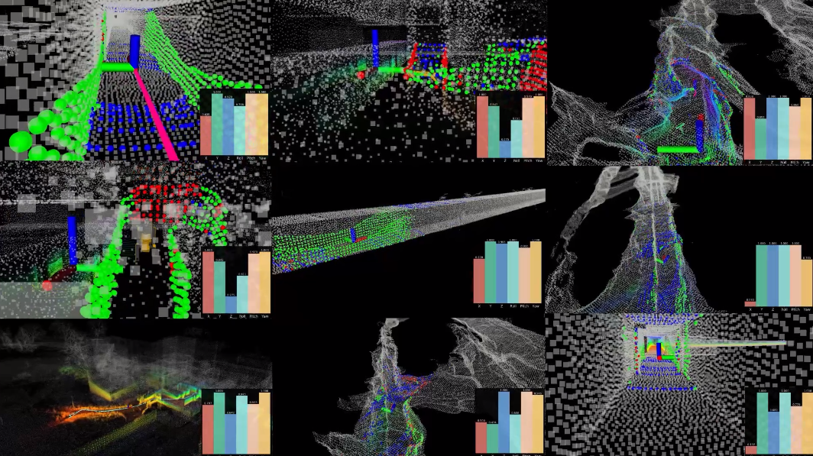
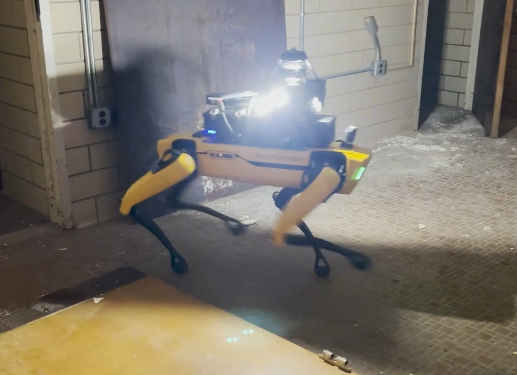
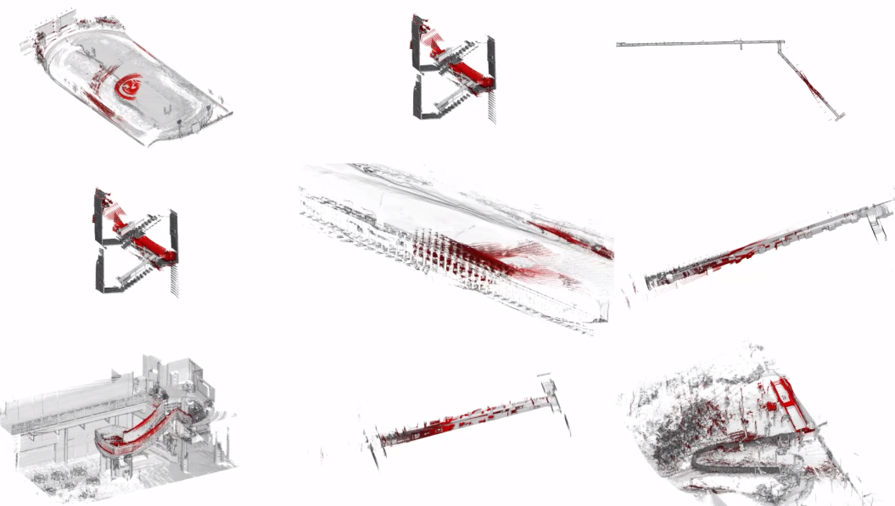

<script>
    window.onload = function () {
        let p = document.getElementsByClassName("title is-2")[0].parentElement;
        p.style.background = "rgba(10, 10, 10, 0.5)";
        p.style.borderRadius = "20px";
        p.style.padding = "20px";
        p.style.width = "fit-content";
        p.style.margin = "0px";
    }

    let p = document.getElementsByClassName("title is-2")[0].parentElement;
    p.style.background = "rgba(10, 10, 10, 0.5)";
    p.style.borderRadius = "20px";
    p.style.padding = "20px";
    p.style.width = "fit-content";
    p.style.margin = "0px";
</script>


<html lang="en">

<head>
    <meta charset="UTF-8">
    <meta name="viewport" content="width=device-width, initial-scale=1.0">
    <title>SuperLoc</title>
    <style>
        .centered-content {
            display: flex;
            flex-direction: column;
            align-items: center;
            text-align: center;
        }
        .links {
            display: flex;
            justify-content: center;
            gap: 10px;
        }
        .figure-container {
            display: flex;
            justify-content: center;
            width: 100%;
            margin: 20px 0;
        }
        .figure-container img {
            width: 100%;
            height: auto;
            max-width: 800px; /* Adjust this value to make the GIF smaller or larger */
        }
        .video-container {
            width: 100%;
            max-width: 800px; /* Adjust this value to make the video smaller */
            margin: 0 auto;
        }
        .bonus-video h4 {
            text-align: center;
            margin-top: 10px;
            font-size: 1em;
        }
        .video-container video {
            width: 100%;
            height: auto;
        }
        .centered-title {
            text-align: center;
            width: 100%;
        }
        .bonus-videos {
            display: flex;
            justify-content: space-between;
            max-width: 1200px;
            margin: 20px auto;
        }
        .bonus-video {
            width: 48%;
        }
        .bonus-video h3 {
            text-align: center;
            margin-top: 10px;
            font-size: 1.17em;
        }
        .bonus-video video {
            width: 100%;
            height: auto;
            display: block;
            border-radius: 5px;
        }
        .figure-container img {
            width: 90%;
            max-width: 1000px; 
            height: auto;
        }
        .figure-description {
            margin-top: 20px;
            text-align: justify;
            font-style: italic;
            color: #555;
            max-width: 90%;
            margin-left: auto;
            margin-right: auto;
        }
        body, html {
            background-color: white;
        }
        .hero.is-light {
            background-color: white;
        }
        .carousel-container {
            position: relative;
            width: 100%;
            max-width: 800px;
            margin: 0 auto;
            overflow: hidden;
        }
        .carousel {
            display: flex;
            transition: transform 0.5s ease-in-out;
        }
        .item {
            flex: 0 0 100%;
        }
        .item video {
            width: 100%;
            height: auto;
            max-height: 600px;
            object-fit: contain;
        }
        .item img {
            width: 100%;
            height: auto;
            max-height: 600px;
            object-fit: contain;
        }
        .nav-button {
            position: absolute;
            top: 50%;
            transform: translateY(-50%);
            background-color: rgba(0, 0, 0, 0.5);
            color: white;
            border: none;
            padding: 10px 15px;
            cursor: pointer;
            z-index: 10;
        }
        .nav-button.prev {
            left: 10px;
        }
        .nav-button.next {
            right: 10px;
        }
        .item-description {
            text-align: center;
            margin-top: 1rem;
            padding: 0 1rem;
            font-size: 1.6rem;
            color: #333;
        }
        .columns {
            display: flex;
            flex-wrap: wrap;
            margin: -0.75rem;
        }
        .column {
            flex: 1 1 45%;
            padding: 0.75rem;
        }
        @media screen and (max-width: 768px) {
            .column {
                flex: 1 1 100%;
            }
        }
        .comparison-video {
            width: 100%;
            height: auto;
            max-height: 450px;
            object-fit: contain;
        }
        .drag-bar {
            display: flex;
            justify-content: center;
            margin-top: 20px;
            gap: 12px;
            flex-wrap: wrap;
            padding: 10px 0;
        }
        .preview-container {
            display: flex;
            gap: 12px;
            justify-content: center;
            align-items: center;
            flex-wrap: nowrap; /* 🔥 this forces everything to stay on one line */
            overflow-x: auto;   /* allows horizontal scrolling if needed */
            padding: 10px 0;
        }
        .preview-wrapper {
            display: flex;
            justify-content: center;
            align-items: center;
        }
        .preview-image {
            width: 110px;
            height: 62px;
            object-fit: cover;
            border-radius: 8px;
            cursor: pointer;
            opacity: 0.6;
            transition: transform 0.3s ease, opacity 0.3s ease, border 0.3s ease;
            border: 2px solid transparent;
        }
        .preview-image:hover {
            transform: scale(1.05);
            opacity: 0.9;
        }
        .preview-image.active {
            transform: scale(1.1);
            opacity: 1;
            border-color: #007bff;
        }

        .drag-handle {
            display: none; /* You can remove this if you're not using it anymore */
        }
        .drag-handle:active {
            cursor: grabbing;
        }
        .preview-wrapper {
            display: flex;
            justify-content: center;
            align-items: center;
            flex: 0 0 auto; /* prevents automatic resizing */
        }

        .expandable-section {
            width: 100%;
            margin: 20px 0;
        }

        .expandable-header {
            background-color: #f5f5f5;
            padding: 15px 20px;
            border-radius: 8px;
            cursor: pointer;
            transition: background-color 0.3s ease;
            display: flex;
            justify-content: space-between;
            align-items: center;
            border: 1px solid #e0e0e0;
        }

        .expandable-header:hover {
            background-color: #ebebeb;
        }

        .expandable-content {
            max-height: 0;
            overflow: hidden;
            transition: max-height 0.5s ease-out;
            background-color: white;
            border: 1px solid #e0e0e0;
            border-top: none;
            border-radius: 0 0 8px 8px;
        }

        .expandable-content.active {
            max-height: 10000px;
            padding: 20px;
        }

        .arrow {
            transition: transform 0.3s ease;
        }

        .arrow.active {
            transform: rotate(180deg);
        }

        .math-content {
            overflow-x: auto;
            padding: 15px;
            margin: 10px 0;
            background-color: #f8f9fa;
            border-radius: 4px;
        }

        .image-container {
            text-align: center;
            margin: 20px 0;
        }

        .image-container img {
            max-width: 100%;
            height: auto;
        }

        .image-caption {
            text-align: center;
            font-style: italic;
            color: #666;
            margin-top: 10px;
        }

        .reference-section {
            margin-top: 40px;
            border-top: 2px solid #eee;
            padding-top: 20px;
        }

        .equation {
            display: block;
            text-align: center;
            margin: 15px 0;
        }
        #references {
            counter-reset: ref-counter;
        }
        #references .reference-item {
            position: relative;
            padding-left: 35px;
            margin-bottom: 10px;
        }
        #references .reference-item:before {
            counter-increment: ref-counter;
            content: "[" counter(ref-counter) "]";
            position: absolute;
            left: 0;
            font-weight: bold;
        }
        
    </style>
</head>


<body>
    <div class="centered-content">
        <h1>Tartan IMU: A Light Foundation Model for Inertial Positioning in Robotics</h1>
        <p class="authors">
            Shibo Zhao<sup>1†*</sup>, Sifan Zhou<sup>1†</sup>, Raphael Blanchard<sup>1</sup>, Yuheng Qiu<sup>1</sup>, Wenshan Wang<sup>1</sup>, Sebastian Scherer<sup>1</sup>
        </p>
        <p class="affiliation">
            <sup>†</sup>Equal contribution, <sup>*</sup>Contact Author<br>
            <sup>1</sup>Carnegie Mellon University
        </p>
        <p class="affiliation">
            <b>Code and Dataset will be released in at the time of CVPR 2025</b>
        </p>
        <center>
        <!-- <a href="#" class="button is-info"> &nbsp;📄Paper</a >
        &nbsp; -->
        <a href="https://openaccess.thecvf.com/content/CVPR2025/papers/Zhao_Tartan_IMU_A_Light_Foundation_Model_for_Inertial_Positioning_in_CVPR_2025_paper.pdf" class="button is-info"> &nbsp;arXiv</a >
        &nbsp;
        <a href="https://github.com/superxslam/SuperOdom" class="button is-info"> &nbsp;<i class="fab fa-github" style="font-size:24px"></i>Code</a >
        &nbsp;
        <a href="https://huggingface.co/datasets/raphael-blanchard/TartanIMU/tree/main" class="button is-info"> &nbsp; Dataset and Checkpoints</a >
        &nbsp;

        
        </center>

    </div>
</body>
<style>
.small-logo {
  width: 16px;
  height: auto;
}
</style>
<style>
.logo {
  width: 28px;
  height: auto;
}
</style>
</html>
<body>


<h1 class="centered-title">Overview Video</h1>
<div>
<br>
    <iframe width="100%" height="400" style="display: block; margin-left: auto; margin-right: auto; width: 50%;"  src="https://www.youtube.com/embed/HqoDL2xiaZA" title="Website - Sensor Video" frameborder="0" allow="accelerometer; autoplay; clipboard-write; encrypted-media; gyroscope; picture-in-picture" allowfullscreen></iframe>
</div>


 <h1 class="centered">About TartanIMU</h1>
<div class="about-section">
    <p>Despite recent advances in deep learning, most existing learning IMU odometry methods are trained on specific datasets, lack generalization, and are prone to overfitting, which limits their real-world application. To address these challenges, we present Tartan IMU, a foundation model designed for generalizable, IMU-based state estimation across diverse robotic platforms.
Our approach consists of three-stage: First, a pre-trained foundation model leverages over 100 hours of multi-platform data to establish general motion knowledge, achieving 36% improvement in ATE over specialized models. Second, to adapt to previously unseen tasks, we use Low-Rank Adaptation (LoRA), allowing positive transfer with only 1.1 M trainable parameters. Finally, to support robotics deployment, we introduce online test-time adaptation, which eliminates the boundary between training and testing, allowing the model to continuously "learn as it operates" at 200 FPS in real-time.</p>
    <div class="figure-container">
        
    </div>
    <p class="figure-description">
    Tartan IMU is to our knowledge the first open-source cross-robot foundation model for pose estimation using solely IMU data.
    </p>
</div>


<h1 class="centered">System architecture</h1>
<div class="system-architecture">
    <div class="image-container">
        
        <p class="image-caption">
            Figure 1: <b>Three learning stages of TartanIMU.</b> <b>(a)</b> Pretrained IMU Model features a shared backbone to capture generalizable IMU knowledge. <b>(b)</b> Efficient Fine-Tuning utilizes an adapter to enable positive transfer for new tasks. <b>(c)</b> Online Adaptation employs an adaptive memory buffer to support on-the-fly model updates during deployment.
        </p>
    </div>
</div>


<!-- <div class="expandable-section">
    <div class="expandable-header">
        <h2 style="margin: 0;">Method</h2>
        <span class="arrow">▼</span>
    </div>
    <div class="expandable-content">
        <p>
        Add here all the explanations on why wanted to get a unified model between robots, explanation with body vs global frame to extract dynamics, robot specific output head for non competing goals...
        </p>
        
        <div class="equation">
            \[\mathbf{x}=A(\mathbf{z})=\operatorname{argmin}_{\mathbf{X}} J(\mathbf{z}, \mathbf{x}) \tag{1}\]
        </div>
        <div class="image-container">
            
            <p class="image-caption">Figure 1: Accuracy comparison of our TartanIMU pre-trained model trained with data from single-robot vs. all-robots.</p>
        </div>
        <h3>Conclusion</h3>
        <p>TBD.</p>
        <div class="reference-section">
            <h4>References</h4>
            <div id="references">
                <div class="reference-item">
                    A. Censi, "An accurate closed-form estimate of icp's covariance", in Proceedings 2007 IEEE international conference on robotics and automation
                </div>
            </div>   
        </div>
    </div>
</div> -->

<h1 id="method">Method</h1>

<div class="expandable-section">
    <div class="expandable-header">
        <h2 style="margin: 0;">Stage 1: Pretrained IMU Model</h2>
        <span class="arrow">▼</span>
    </div>
    <div class="expandable-content">
        <p>
            To enable cross-platform generalization, we train a foundational inertial odometry model using over 100 hours of raw 6-DoF IMU data from four distinct platforms: a car, drone, dog, and human. 
            Instead of using a monolithic network, we design a heterogeneous backbone architecture with modality-specific encoders that capture platform-specific motion patterns.
        </p>
        <p>
            We avoid forcing a single representation space across modalities by incorporating a multi-head prediction strategy, with one head per platform. 
            This allows the model to share a unified feature representation while maintaining tailored outputs for each platform’s kinematic structure.
        </p>
        <p>
            Crucially, the model operates in the robot’s local body frame rather than a global frame, ensuring that learned dynamics reflect platform-intrinsic motion properties 
            rather than global orientation or trajectory. This choice helps the network develop representations that are transferable and grounded in robot-specific behavior.
        </p>
        <div class="image-container">
            
            <p class="image-caption">Figure: t-SNE visualization of the learned ResNet feature space. Cluster separation across platforms shows the model's ability to learn motion-specific dynamics.</p>
        </div>
    </div>
</div>


<div class="expandable-section">
    <div class="expandable-header">
        <h2 style="margin: 0;">Stage 2: Efficient Fine-Tuning</h2>
        <span class="arrow">▼</span>
    </div>
    <div class="expandable-content">
        <p>
            Once the base TartanIMU model is pretrained, we adapt it to unseen robot motions or challenging deployment scenarios using <strong>Low-Rank Adaptation (LoRA)</strong>. This technique introduces only a small number of trainable parameters while freezing the original model, preserving its robust general motion understanding.
        </p>
        <p>
            LoRA achieves this by reparameterizing weight updates as a low-rank matrix decomposition:
        </p>
        <div class="equation">
            \[ h = W_0 x + \Delta W x = W_0 x + B A x \tag{1} \]
        </div>
        <p>
            Here, \(W_0\) is the pretrained weight, and \(A, B\) are the small matrices trained for the new task. This structure ensures that learning is efficient, allowing use even with very limited data.
        </p>
        <div class="image-container">
            
            <p class="image-caption">Figure: Our LoRA-based finetuning improves accuracy on new motion tasks while keeping computational and data costs low.</p>
        </div>
        <p>
            One of the key benefits of LoRA adaptation is <strong>non forgetting</strong>: the core representation remains stable across tasks. This enables lifelong learning capabilities and is particularly useful in robotics where new environments and tasks are continuously encountered.
        </p>
        <div class="image-container">
            
            <p class="image-caption">Figure: Comparison of LoRA vs. full fine-tuning. LoRA retains prior knowledge, while full finetuning can degrade earlier performance.</p>
        </div>
    </div>
</div>


<div class="expandable-section">
    <div class="expandable-header">
        <h2 style="margin: 0;">Stage 3: Online Adaptation</h2>
        <span class="arrow">▼</span>
    </div>
    <div class="expandable-content">
        <p>
            In the final stage of our TartanIMU pipeline, we enable real-time test-time adaptation through a novel online learning strategy.
            Unlike traditional pipelines that maintain a static model during deployment, we allow the model to evolve as it operates.
            This is critical in real-world robotics, where domain shifts such as speed, terrain, or motion patterns frequently occur.
        </p>
        <p>
            To support this, we maintain a lightweight, adaptive training buffer that stores recent IMU samples during deployment.
            These samples are filtered and clustered via a Gaussian Mixture Model (GMM) based motion classifier to ensure diversity across motion types—e.g., stationary, forward motion, left turns, and right turns.
            The buffer actively reselects samples to avoid redundancy, enabling quick and stable updates with minimal compute.
        </p>
        <div class="image-container">
            
            <p class="image-caption">
                Figure: Online adaptation results in an 8-shaped trajectory using only IMU data. By maintaining a balanced buffer across diverse motion segments, TartanIMU adapts quickly during deployment, improving trajectory accuracy over time.
            </p>
        </div>
        <p>
            Beyond standalone IMU-based estimation, TartanIMU can also be integrated within a broader SLAM framework. When external pose sources (e.g., LiDAR-based SLAM) are reliable, their estimates are used to supervise the model through consistency loss. However, in degraded environments (e.g., dense smoke, snow, dust), where SLAM performance drops, we fallback to TartanIMU predictions to maintain continuity in pose estimation.
        </p>
        <div class="image-container">
            
            <p class="image-caption">
                Figure: Integration with SLAM pipelines. In clear conditions, LiDAR odometry supervises TartanIMU. When visual degradation (e.g., dense smoke) occurs, the system switches to TartanIMU predictions until reliability is restored.
            </p>
        </div>
        <p>
            This bidirectional fusion—SLAM supervising TartanIMU during reliable tracking and TartanIMU filling the gap during failure—allows our system to remain robust even in severely degraded or high-speed conditions. This design ensures persistent localization despite transient sensor degradation or extreme motion.
        </p>
    </div>
</div>


<!-- <h2 id="experiments-1">Generalization</h2>
Videos of each robot, or just picture of paper figure?
Dropdown or keep like this? I think dropdown to explain the motivation behind having a shared latent space etc...


<h2 id="experiments-2">Fine tuning for unseen motions</h2>
Same questions for this part, dropdown or no?

<h2 id="experiments-3">Online Adaptation</h2>
Same here. -->

<h1 id="results">Results (Foundation Model + Online Adaptation)</h1>

<section class="hero is-light is-small">
    <div class="hero-body">
        <div class="container">
            <div class="carousel-container">
                <div id="results-carousel" class="carousel">
                    <div class="item">
                        <video muted loop playsinline controls>
                            <source src="video/superloc/website_intro3.mp4" type="video/mp4">
                            Your browser does not support the video tag.
                        </video>
                        <p class="item-description">Quadruped (Foundation Model)</p>
                    </div>
                    <div class="item">
                        <video muted loop playsinline controls>
                            <source src="video/superloc/website_intro1.mp4" type="video/mp4">
                            Your browser does not support the video tag.
                        </video>
                        <p class="item-description">Drone (Foundation Model)</p>
                    </div>
                    <div class="item">
                        <video muted loop playsinline controls>
                            <source src="video/superloc/website_intro2.mp4" type="video/mp4">
                            Your browser does not support the video tag.
                        </video>
                        <p class="item-description">Human (Foundation Model)</p>
                    </div>
                    <div class="item">
                        <video muted loop playsinline controls>
                            <source src="video/superloc/website_intro3.mp4" type="video/mp4">
                            Your browser does not support the video tag.
                        </video>
                        <p class="item-description">UGV (Foundation Model)</p>
                    </div>
                    <div class="item">
                        <video muted loop playsinline controls>
                            <source src="video/superloc/website_intro3.mp4" type="video/mp4">
                            Your browser does not support the video tag.
                        </video>
                        <p class="item-description">Off-road Car (Online Adaptation)</p>
                    </div>
                </div>
            </div>
            <div class="drag-bar modern-preview-bar">
                <div class="preview-container">
                    <div class="preview-wrapper">
                        
                    </div>
                    <div class="preview-wrapper">
                        
                    </div>
                    <div class="preview-wrapper">
                        
                    </div>
                    <div class="preview-wrapper">
                        
                    </div>
                    <div class="preview-wrapper">
                        
                    </div>

                </div>
                <div class="drag-handle modern-drag-handle"></div>
            </div>
        </div>
    </div>
</section>


<script>
document.addEventListener('DOMContentLoaded', function() {
    const carousel = document.querySelector('#results-carousel');
    const dragBar = document.querySelector('.drag-bar');
    const dragHandle = document.querySelector('.drag-handle');
    const previewImages = document.querySelectorAll('.preview-image');
    const items = carousel.querySelectorAll('.item');
    const videos = carousel.querySelectorAll('video');
    let isDragging = false;
    let startX, startLeft;

    function showItem(index) {
        carousel.style.transform = `translateX(-${index * 100}%)`;
        videos.forEach(video => {
            video.pause();
            video.currentTime = 0;
        });
        videos[index].play().catch(e => console.error("Error playing video:", e));
        previewImages.forEach((img, i) => {
            img.classList.toggle('active', i === index);
        });
        dragHandle.style.left = `${index * 33.33}%`;
    }

    dragHandle.addEventListener('mousedown', (e) => {
        isDragging = true;
        startX = e.clientX - dragHandle.offsetLeft;
        startLeft = dragHandle.offsetLeft;
    });

    document.addEventListener('mousemove', (e) => {
        if (!isDragging) return;
        e.preventDefault();
        let newLeft = e.clientX - startX;
        newLeft = Math.max(0, Math.min(newLeft, dragBar.offsetWidth - dragHandle.offsetWidth));
        dragHandle.style.left = `${newLeft}px`;
        
        const progress = newLeft / (dragBar.offsetWidth - dragHandle.offsetWidth);
        const index = Math.round(progress * (items.length - 1));
        showItem(index);
    });

    document.addEventListener('mouseup', () => {
        isDragging = false;
    });

    previewImages.forEach((img, index) => {
        img.addEventListener('click', () => {
            showItem(index);
        });
    });

    // Initialize
    showItem(0);
});
</script>
</body>


<!-- <h1>Cave</h1>
<div class="about-section">
</div>
<div class="bonus-videos">
    <div class="bonus-video">
        <video class="lazy-video" data-src="./video/superloc/cave_website1.mp4" muted loop playsinline controls>
        </video>
    </div>
    <div class="bonus-video">
        <video class="lazy-video" data-src="./video/superloc/cave_comparsion_website.mp4" muted loop playsinline controls>
        </video>
    </div>
</div>

<h1>Multi-floor</h1>
<div class="about-section">
</div>
<div class="bonus-videos">
    <div class="bonus-video">
        <video class="lazy-video" data-src="./video/superloc/multi_floor_website1.mp4" muted loop playsinline controls>
        </video>
    </div>
    <div class="bonus-video">
        <video class="lazy-video" data-src="./video/superloc/multi_floor_comparsion_wesbite.mp4" muted loop playsinline controls>
        </video>
    </div>
</div>


<h1>Long Corridor</h1>
<div class="about-section">
</div>
<div class="bonus-videos">
    <div class="bonus-video">
        <video class="lazy-video" data-src="./video/superloc/long_corridor_website1.mp4" muted loop playsinline controls>
        </video>
    </div>
    <div class="bonus-video">
        <video class="lazy-video" data-src="./video/superloc/long_corridor_comparsion_website.mp4" muted loop playsinline controls>
        </video>
    </div>
</div> -->


<!-- Would be nice to have some videos showing real world + overlay of 3D trajectory with our prediction against GT and other approaches. -->


<script>
document.addEventListener('DOMContentLoaded', function() {
    const carousel = document.querySelector('#comparison-carousel');
    const items = carousel.querySelectorAll('.item');
    const prevButton = document.querySelector('#comparison-prev');
    const nextButton = document.querySelector('#comparison-next');
    const videos = carousel.querySelectorAll('video');
    let currentIndex = 0;

    function showItem(index) {
        carousel.style.transform = `translateX(-${index * 100}%)`;
        videos.forEach(video => {
            video.pause();
        });
        videos[index].play().catch(e => console.error("Error playing video:", e));
    }

    prevButton.addEventListener('click', () => {
        currentIndex = (currentIndex - 1 + items.length) % items.length;
        showItem(currentIndex);
    });

    nextButton.addEventListener('click', () => {
        currentIndex = (currentIndex + 1) % items.length;
        showItem(currentIndex);
    });

    videos.forEach(video => {
        video.addEventListener('click', () => {
            if (video.paused) {
                video.play();
            } else {
                video.pause();
            }
        });
    });

    showItem(currentIndex);
});


document.querySelectorAll('.expandable-header').forEach(header => {
    header.addEventListener('click', function() {
        const content = header.nextElementSibling;
        const arrow = header.querySelector('.arrow');
        content.classList.toggle('active');
        arrow.classList.toggle('active');
    });
});


if (!window.MathJax) {
    const script = document.createElement('script');
    script.src = 'https://cdnjs.cloudflare.com/ajax/libs/mathjax/2.7.7/MathJax.js?config=TeX-MML-AM_CHTML';
    document.head.appendChild(script);
}
</script>

<br>

<!-- <h4>To benefit the open community, our localization package also includes following features,</h4>
<div class="about-section">
</div>
<div class="bonus-videos">
    <div class="bonus-video">
        <h3>Robust Initialization</h3>
        <video class="lazy-video" data-src="./video/superloc/cic_robust_initialization_10.mp4" muted loop playsinline controls>
        </video>
    </div>
    <div class="bonus-video">
        <h3>Transition between mapped and unmapped region</h3>
        <video class="lazy-video" data-src="./video/superloc/cic_mapped_unmapped_4.mp4" muted loop playsinline controls>
        </video>
    </div>
</div> -->

<script>
document.addEventListener("DOMContentLoaded", function() {
    var lazyVideos = [].slice.call(document.querySelectorAll("video.lazy-video"));

    if ("IntersectionObserver" in window) {
        var lazyVideoObserver = new IntersectionObserver(function(entries, observer) {
            entries.forEach(function(video) {
                if (video.isIntersecting) {
                    video.target.src = video.target.dataset.src;
                    video.target.load();
                    video.target.play(); // Auto-play when in view
                    video.target.classList.remove("lazy-video");
                    lazyVideoObserver.unobserve(video.target);
                }
            });
        });

        lazyVideos.forEach(function(lazyVideo) {
            lazyVideoObserver.observe(lazyVideo);
        });
    }
});
</script>

<!-- ## Ground Truth Map 
<head>
    <meta charset="UTF-8">
    <meta name="viewport" content="width=device-width, initial-scale=1.0">
    <title>Ground Truth Maps</title>
    <style>
        .map-container {
            display: flex;
            justify-content: space-between;
            flex-wrap: wrap;
        }
        .map-item {
            width: 48%;
            min-width: 300px;
            margin-bottom: 20px;
        }
        h3 {
            text-align: center;
        }
        @media (max-width: 768px) {
            .map-item {
                width: 100%;
            }
        }
    </style>
</head> -->
<!-- <body>
    <h4>To benefit the open community, we release the following ground truth maps for localization:</h4>
    <div class="map-container">
        <div class="map-item">
            <h3><a href="https://hawkins-gt-map.s3.us-east-2.amazonaws.com/hawkins.html" target="_blank">Hawkins</a></h3>
            <iframe src="https://hawkins-gt-map.s3.us-east-2.amazonaws.com/hawkins.html" width="100%" height="600"></iframe>
        </div>
        <div class="map-item">
            <h3><a href="https://laurel-craven-gt-map.s3.us-east-2.amazonaws.com/laurel_craven.html" target="_blank">Laurel Craven</a></h3>
            <iframe src="https://laurel-craven-gt-map.s3.us-east-2.amazonaws.com/laurel_craven.html" width="100%" height="600"></iframe>
        </div>
    </div>
</body> -->


<h2 id="dataset">Dataset</h2>
Change the table under with what we used/what we release.
Quick note about 200Hz data from various IMUs (robot and sensor wise).
Maybe for online adaptation mention that we use pose feedback from SLAM that way we can reference SuperOdometry.

All datasets from our paper is released as follow, 

| Name | Source    | Location  | Robot     |Sensor     | Trajectory | Duration  |  Rosbag | Calibration (Extrinsics) | Calibration (Intrinsics) | GT Map | GT Traj. |
|------|-----------|-----------|-----------|-----------|-------------|-----------|-------------|-----------|---------------|--------------|--------------|
|Cave01    |SuperLoc|Laurel Craven|Handheld|RGB,LiDAR,IMU|416|838|[link](https://drive.google.com/file/d/1cyHbmxmJQGuK5UCm_f7SXomr8Gd6GEww/view?usp=sharing)| [Google](https://drive.google.com/file/d/1TzIvJuJ3ulYSOdrXRy9wRm1E2Y5AE7g1/view?usp=sharing) Baidu | [Google](https://drive.google.com/file/d/1XfWfpjMqfPHUO8JNy1u9Ysky6vvTpn8_/view?usp=sharing) Baidu | [link](https://drive.google.com/file/d/1JYSVgunLJj6Fj-MsDoNIDHRDx51YWsQP/view?usp=sharing) | [link](https://drive.google.com/file/d/17JiwUXJ6xZMkL7GSNQg_kV-ZJfKczxak/view?usp=sharing)
|Cave02    |SuperLoc|Laurel Craven|Handheld|RGB,LiDAR,IMU|475|986|[link](https://drive.google.com/file/d/1HwUYboHbCh4_GfyvZYQn25KmA12yiuMR/view?usp=sharing)| [Google](https://drive.google.com/file/d/1TzIvJuJ3ulYSOdrXRy9wRm1E2Y5AE7g1/view?usp=sharing) Baidu | [Google](https://drive.google.com/file/d/1XfWfpjMqfPHUO8JNy1u9Ysky6vvTpn8_/view?usp=sharing) Baidu | [link](https://drive.google.com/file/d/1JYSVgunLJj6Fj-MsDoNIDHRDx51YWsQP/view?usp=sharing) | [link](https://drive.google.com/file/d/1_7D70MVcUbaJqlzN_xlDkguF1qiyZCqF/view?usp=sharing)

We also provide initialization poses for each dataset to support localization modules that allows initial pose configuration. <b>You can find corresponding initial pose config for each dataset [here](https://drive.google.com/drive/folders/1WZsyEYyU-_8ps1CUqRq3YO7IaARMdGNm?usp=sharing)</b>. 

<b>Ground truth trajectory</b> follows [TUM](https://github.com/MichaelGrupp/evo/wiki/Formats) format, 
<pre><code>timestamp x y z q_x q_y q_z q_w</code></pre>


## Citation

Zhao, et al. "Tartan IMU: A Light Foundation Model for Inertial Positioning in Robotics." 2025 IEEE/CVF Conference on Computer Vision and Pattern Recognition (CVPR). IEEE, 2025.
```
@InProceedings{Zhao_2025_CVPR,
    author    = {Zhao, Shibo and Zhou, Sifan and Blanchard, Raphael and Qiu, Yuheng and Wang, Wenshan and Scherer, Sebastian},
    title     = {Tartan IMU: A Light Foundation Model for Inertial Positioning in Robotics},
    booktitle = {Proceedings of the Computer Vision and Pattern Recognition Conference (CVPR)},
    month     = {June},
    year      = {2025},
    pages     = {22520-22529}
}
```

## Contacts

If you have any questions or want to contribute to this work, please feel free to send email to Shibo Zhao (shiboz@andrew.cmu.edu). Thank you! :)